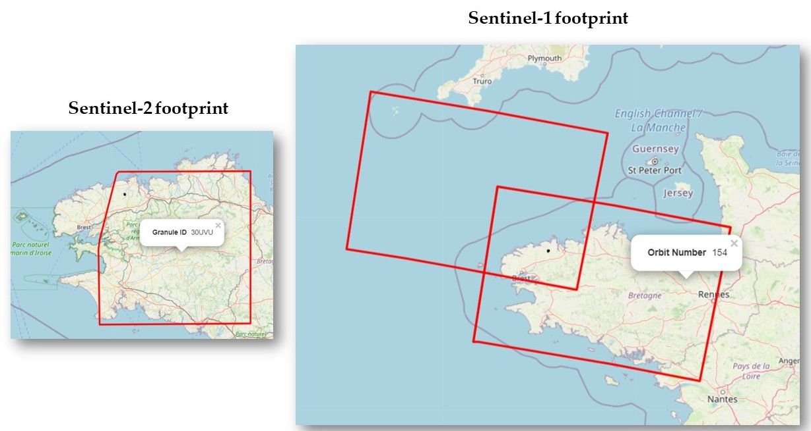

# From GEE to NPY
#### A GEE python-api script for downloading parcel-level Sentinel-1 / Sentinel-2 time series as NumPy
Returns array of size ```T x C x N ```
* T --> number of acquisitions
* C --> number of channels/bands
* N --> number of pixels within parcel


### Setup

Install earthengine-api using
```
pip install earthengine-api
```

Follow instructions [here](https://developers.google.com/earth-engine/guides/python_install) to authenticate


### Example

Requirements
* packages : earthengine-api + shapely + geojson + tqdm  
* input parcel : geojson file containing parcel geometry with crop label column e.g. 'CODE_GROUP' and crop ID column e.g. 'ID_PARCEL'


Notes
Footprint argument is optional. However to control which Sentinel-1/2 footprints are used, pre-run Example_findFootprint.ipynb


```python

# Sentinel-1 
get_data.py --rpg_file farms.geojson, --label_names ['CODE_GROUP'] --id_field ID_PARCEL --output_dir C:/downloads/s1_data --col_id COPERNICUS/S1_GRD --start_date 2021-01-01 end_date 2021-01-31 --speckle_filter mean --footprint_id [154]

# Sentinel-2
get_data.py --rpg_file farms.geojson, --label_names ['CODE_GROUP'] --id_field ID_PARCEL --output_dir C:/downloads/s2_data --col_id COPERNICUS/S2_SR  --footprint_id ["30UVU"] --start_date 2021-01-01 end_date 2021-01-31 
```


### Contributor
* [Dr. Charlotte Pelletier](https://sites.google.com/site/charpelletier)

### Credits
* Multi-temporal despeckling from [WeiyingZhao](https://github.com/WeiyingZhao/Multitemporal-Sentinel-1-images-denoising-and-downloading-via-GEE)
* Parcel data preprocessing from [VSainteuf](https://github.com/VSainteuf/pytorch-psetae/tree/master/preprocessing)
* Sample parcels obtained from [IGN Registre parcellaire graphique (RPG)](https://www.data.gouv.fr/fr/datasets/registre-parcellaire-graphique-rpg-contours-des-parcelles-et-ilots-culturaux-et-leur-groupe-de-cultures-majoritaire/) 
